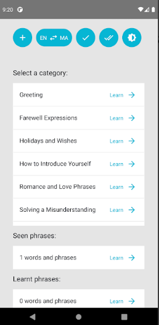
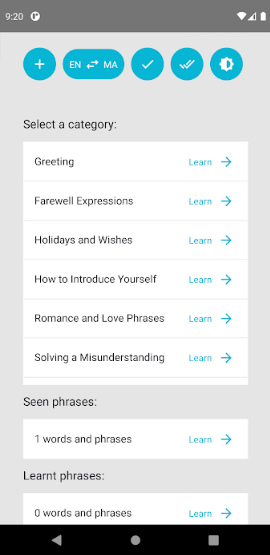
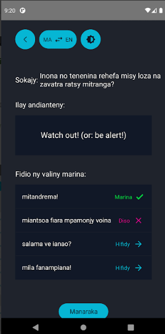

<h1 align="center">
  React Native Learn Malagasy/English
</h1>

<div align="center">
  <h3>
    <a href="https://github.com/Voninkazo/sandy-portfolio">
      Source
    </a>
    <span> | </span>
    <a href="https://play.google.com/store/apps/details?id=com.learngasy&hl=en&gl=US">
      Demo
    </a>
  </h3>
</div>

This project is built with react native. It is an application that helps people to learn both English and Malagasy. Find it on [google play store](https://play.google.com/store/apps/details?id=com.learngasy&hl=en&gl=US) and start.

In a team of three developers, I worked on building the components and some of the UI. We use storybooks to test the components and Redux as a state management. Together we implemented the functionalities and got the app working without props driling.





# Quick Start 🚀

# install

    ```bash
    yarn install
    ```

# run

Update stories availabe for storybook and run react-native start

```bash
yarn start
```

in separate terminal

```bash
yarn android
```

or

```bash
yarn ios
```

# use storybook

Enter dev menu on phone crtl + m (for android) select toggle storybook

# problems

if you get

```bash
Error: spawn ./gradlew EACCES
```

while running `yarn android`

try

```
chmod 755 android/gradlew
```
